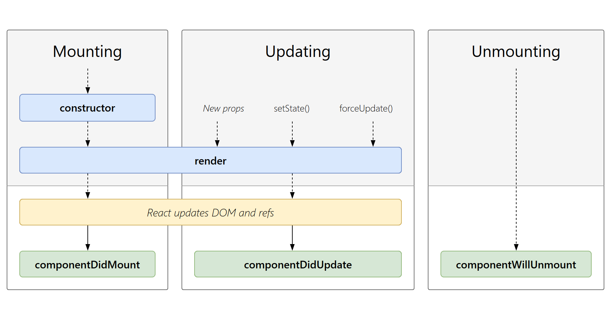

# React Lifecycle

Sama seperti library lain, yang pada umumnya memiliki siklus hidup, begitu juga React memiliki siklus hidupnya sendiri, React juga memiliki siklus hidup yang berbeda antara _**Class Component**_ & _**Function Component**_&#x20;

## Lifecycle Class Component

<figure><figcaption></figcaption></figure>

### Mounting ( Pemasangan )

Tahap ini terjadi saat sebuah komponen sedang dibuat dan dimasukkan ke dalam DOM untuk pertama kalinya.

<pre class="language-javascript"><code class="lang-javascript">import React from 'react';

class App extends React.Component {
  // Dieksekusi pertama kali
<strong>  constructor(props) {
</strong><strong>    super(props);
</strong><strong>    this.state = { count: 0 };
</strong><strong>    console.log('Mounting: Constructor');
</strong><strong>  }
</strong>
  // Dieksekusi setelah render
<strong>  componentDidMount() {
</strong><strong>    console.log('Mounting: Component did mount');
</strong><strong>  }
</strong>
  // Diekseskusi setelah state didefine
<strong>  render() {
</strong>    console.log('Rendering');
    return (
      &#x3C;div>
        &#x3C;p>Count: {this.state.count}&#x3C;/p>
      &#x3C;/div>
    );
  }
}

export default App;
</code></pre>

* `constructor`,  dipanggil saat pembuatan instance komponen. Di sini, kita bisa melakukan inisialisasi state dan binding metode.&#x20;
* `componentDidMount`, dipanggil setelah komponen berhasil dirender ke DOM. Ini biasanya digunakan untuk memuat data dari server atau menyiapkan data yang akan ditampilkan.
* `render`, Metode ini mengembalikan elemen yang akan ditampilkan di UI.

### Updating ( Pembaruan )

Tahap ini terjadi saat sebuah komponen sedang diperbarui dengan prop baru atau state baru. React memutuskan apakah perlu memperbarui komponen berdasarkan perubahan yang terjadi.&#x20;

<pre class="language-javascript"><code class="lang-javascript">import React from 'react';

class App extends React.Component {
  constructor(props) {
    super(props);
    this.state = { count: 0 };
    console.log('Mounting: Constructor');
  }

  componentDidMount() {
    console.log('Mounting: Component did mount');
  }

  // Dieksekusi setelah dilakukan update terhadap state
<strong>  componentDidUpdate(prevProps, prevState) {
</strong><strong>    console.log('Updating: Component did update');
</strong><strong>    console.log('Previous state:', prevState);
</strong><strong>    console.log('Current state:', this.state);
</strong><strong>  }
</strong>
  handleClick = () => {
    this.setState((prevState) => ({ count: prevState.count + 1 }));
  };

  render() {
    console.log('Rendering');

    return (
      &#x3C;div>
        &#x3C;p>Count: {this.state.count}&#x3C;/p>
        &#x3C;button onClick={this.handleClick}>Increment&#x3C;/button>
      &#x3C;/div>
    );
  }
}

export default App;
</code></pre>

* `componentDidUpdate`, dipanggil setelah pembaruan komponen dan re-render. Ini memungkinkan  untuk melakukan aksi setelah perubahan terjadi.

### Unmounting ( Penghancuran )

Tahap ini terjadi saat sebuah komponen sedang dihapus dari DOM. Ini bisa terjadi karena komponen tersebut tidak lagi diperlukan atau karena perubahan pada aplikasi.&#x20;

<pre class="language-javascript"><code class="lang-javascript">import React from 'react';

class App extends React.Component {
  constructor(props) {
    super(props);
    this.state = { count: 0 };
    console.log('Mounting: Constructor');
  }

  componentDidMount() {
    console.log('Mounting: Component did mount');
  }

  componentDidUpdate(prevProps, prevState) {
    console.log('Updating: Component did update');
    console.log('Previous state:', prevState);
    console.log('Current state:', this.state);
  }

<strong>  componentWillUnmount() {
</strong><strong>    console.log('Unmounting: Component will unmount');
</strong><strong>  }
</strong>
  handleClick = () => {
    this.setState((prevState) => ({ count: prevState.count + 1 }));
  };

  render() {
    console.log('Rendering');

    return (
      &#x3C;div>
        &#x3C;p>Count: {this.state.count}&#x3C;/p>
        &#x3C;button onClick={this.handleClick}>Increment&#x3C;/button>
      &#x3C;/div>
    );
  }
}

export default App;
</code></pre>

* `componentWillUnmount`, dipanggil sebelum komponen dihapus dari DOM. Ini digunakan untuk membersihkan sumber daya yang tidak terpakai.

## Lifecycle Functional Component

Memiliki siklus hidup yang berbeda, functional component menggunakan [Reactive Effects](https://react.dev/learn/lifecycle-of-reactive-effects)  yang dimana secara general cuman memilki 2 fase, yakni `start synchronizing` dan `stop synchronizing`

Start synchronizing adalah dimana proses mounting dan update dilakukan,  Stop synchronizing adalah proses unmounting, dimana perintah yang sudah tidak butuhkan lagi akan dibershikan.

### Mounting Effect

Pada fase ini kita bisa memulai mounting tanpa adanya effect dari value lain. difase ini juga kita bisa melakukan define data yang akan ditampilkan di UI, misalkan proses untuk mengambil data dari server, bahkan mengolah datanya.

<pre class="language-typescript"><code class="lang-typescript">import React, { useState, useEffect } from 'react';

const App: React.FC = () => {
  const [count, setCount] = useState&#x3C;number>(0);

<strong>  useEffect(() => {
</strong><strong>    setCount(1)
</strong><strong>  }, [])  
</strong>
  return (
    &#x3C;div>
      &#x3C;p>Count: {count}&#x3C;/p>
    &#x3C;/div>
  );
};

export default App;
</code></pre>

### Update Effect

Fase dimana kita bisa melakukan update data pada effect yang bergantung pada value dari dependecy yang telah ditentukan.

<pre class="language-typescript"><code class="lang-typescript">import React, { useState, useEffect } from 'react';

const App: React.FC = () => {
  const [count, setCount] = useState&#x3C;number>(0);
  const [message, setMessage] = useState&#x3C;string>('');

  // Dieksekusi sekali
  useEffect(() => {
    setCount(1)
  }, [])  

<strong>  // Akan diekseskusi sekali &#x26; selanjutnya apa bila nilai count berubah
</strong><strong>  useEffect(() => {
</strong><strong>    if(count > 10){
</strong><strong>        setMessage('Sudah mencapai nilai maksimum!')
</strong><strong>    }else{
</strong><strong>        setMessage('Nilai belum maksimum!')
</strong><strong>    }
</strong><strong>  }, [count])
</strong>
  const handleClick = () => {
    setCount(prevCount => prevCount + 1);
  };

  return (
    &#x3C;div>
      &#x3C;p>Count: {count}&#x3C;/p>
      &#x3C;button onClick={handleClick}>Increment&#x3C;/button>
      &#x3C;p>Message: {message}&#x3C;/p>
    &#x3C;/div>
  );
};

export default App;
</code></pre>

### Clean Effect

Fase dimana kita dapat membershikan perintah-perintah yang sudah tidak diperlukan lagi.

<pre class="language-typescript"><code class="lang-typescript">import React, { useState, useEffect } from 'react';

const App = () => {
  const [timer, setTimer] = useState(0);

<strong>  useEffect(() => {
</strong><strong>    const timeoutId = setTimeout(() => {
</strong><strong>      setTimer(prevTimer => prevTimer + 1);
</strong><strong>    }, 1000);
</strong>
<strong>    // Membersihkan timeout saat komponen tidak lagi diperlukan (unmount)
</strong><strong>    return () => {
</strong><strong>      clearTimeout(timeoutId);
</strong><strong>    };
</strong><strong>  }, [timer]); // Jadikan timer sebagai dependency untuk memastikan timeout diperbarui setiap kali nilai timer berubah
</strong>
  return (
    &#x3C;div>
      &#x3C;h1>Timer: {timer}&#x3C;/h1>
    &#x3C;/div>
  );
};

export default App;
</code></pre>

